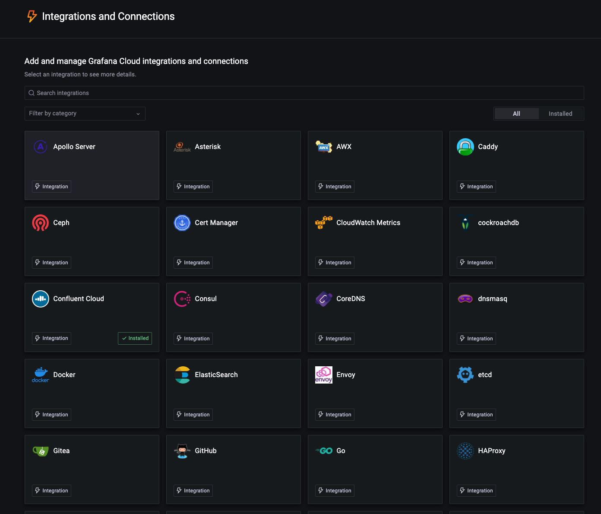
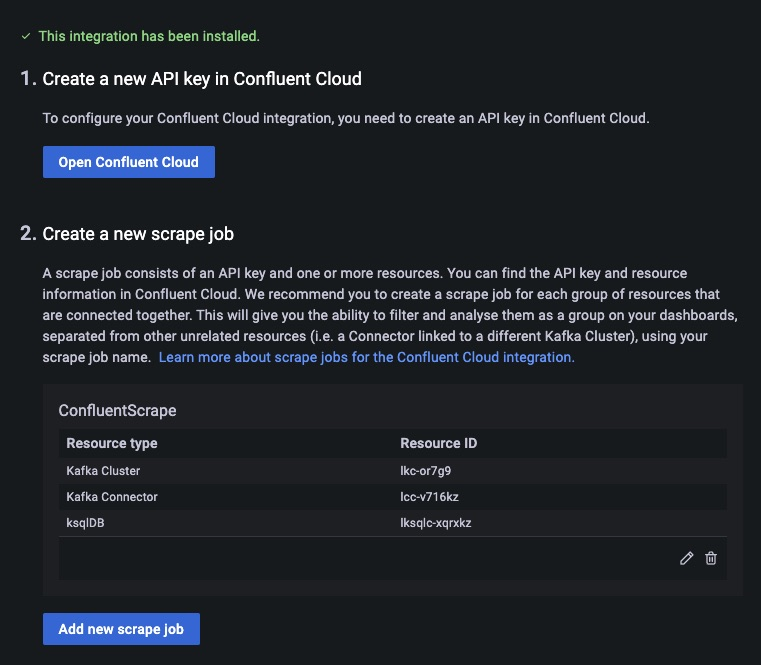
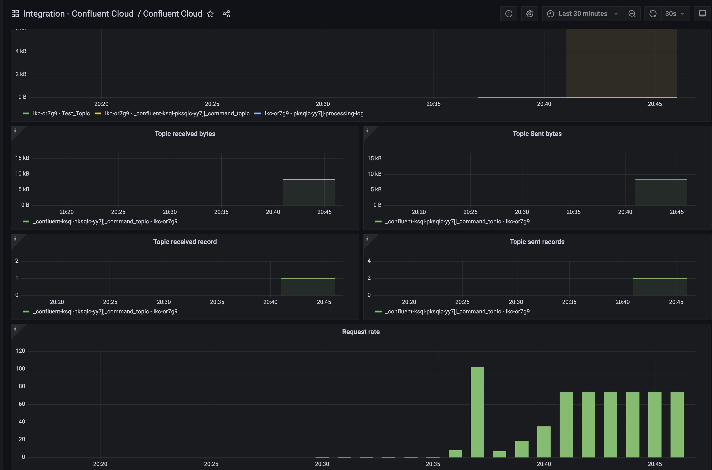

#
# Confluent Cloud Metrics / Grafana Cloud Demo
#

Grafana Cloud integrates with the Confluent metrics API. 

**auth-setup.sh** Creates a Confluent Cloud service account for Grafana API monitoring, allocates the `MetricsViewer` role to it, and generates an API key for it.

**list-resource.sh** lists resource names and IDs that can be scraped into Grafana Cloud for monitoring.

**Doc:** https://grafana.com/docs/grafana-cloud/integrations/integrations/integration-confluent-cloud/

**Blog:** TBD

**HOWTO**

1. Use `confluent login` to login to Confluent Cloud using an account with organization admin privileges.

2. Run `auth-setup.sh` to generate service account and API key.

3. Run `list-resource.sh` to obtain resource IDs for components that can be monitored.
 
4. Select Confluent Cloud from the Integrations menu in Grafana Cloud

5. Input API key and service IDs for monitoring

6. View Confluent Cloud dashboard in grafana cloud

